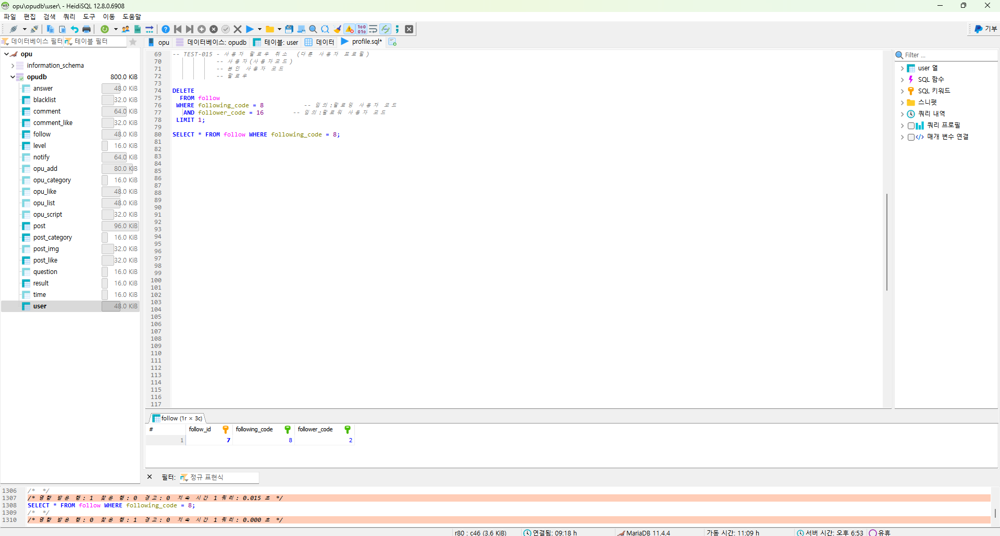
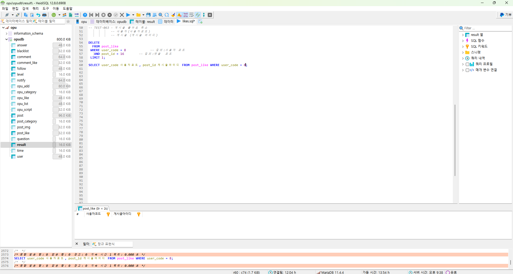
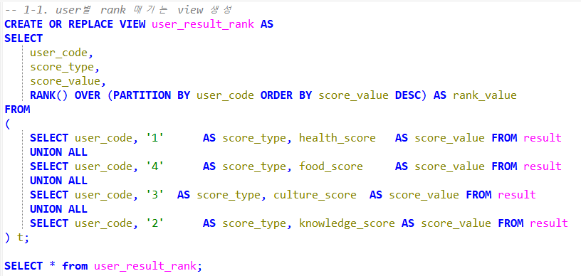

## "작은 습관이 쌓이면 큰 변화를 만듭니다. 지금, 당신의 목표를 실천해보세요!" 

 

# 🏆 팀 소개 - F1T5

| 🦊 김경민 | 🐱 김채원 | 🦑 차명호 | 🐰 윤채영 | 🦉 정유진 | 🐼 김여진 |
| :---: | :---: | :---: | :---: | :---: | :---: |
|ISFP|ESTP|ESTP|ESTP|ESTJ|ISTJ|
| | | |  | | |

 

# ✅ 프로젝트 소개
## 오퓨(OPU) : 작은 목표를 설정하고 꾸준히 수행하며 이를 기록하고 공유하는 목표 성장 플랫폼

**오퓨(OPU)** 는 일상 속에서 실현 가능한 작은 목표를 설정하고, 꾸준히 수행하는 자기계발 방식입니다. 목표 수행 과정에서 성취감을 느끼며 자기 성장과 발전을 도모할 수 있도록 설계된 플랫폼입니다.

- **맞춤형 목표 추천** : 성향 검사 결과를 바탕으로 사용자가 실천 가능한 목표를 제시합니다.

- **기록** : 해당 목표의 수행 과정을 기록하여, 기록을 바탕으로 새로운 변화를 주도할 수 있습니다. 

- **커뮤니티 지원** : 목표 도전과 성취 후기를 공유하고 응원을 주고받으며 함께 성장할 수 있는 환경을 제공합니다. 

- **지속적 목표 달성 관리** : 푸시 알림, 성취도 관리, 캘린더 연동 등 체계적인 기능으로 목표 달성을 지원합니다. 

 

# 💡 원 포인트 업이란?

'**원 포인트 업**'은 한 번에 거창한 목표를 세우기보다 **작은 목표를 하나씩 꾸준히 달성**하는 방식의 자기계발 전략입니다. 매일의 작은 성공이 점진적인 성장으로 이어지며, 이를 통해 더 큰 목표에 도전할 자신감을 얻게 됩니다.

> 📌 오퓨(OPU)는 이러한 '원 포인트 업' 방식을 기반으로 사용자가 성취감을 경험하며 지속적으로 발전할 수 있도록 설계되었습니다.

 

# 🖼️ 프로젝트 배경

## (1) 현대 사회와 자기 계발 트렌드 

- 현대 사회는 빠르게 변화하고 있으며, 자기 계발에 대한 관심이 높아지고 있습니다. 그러나 동시에 여러 목표를 한꺼번에 세우고 실패하는 경우도 빈번하게 발생합니다. 이런 상황은 목표 설정에 대한 부담감과 좌절로 이어질 수 있습니다.

- 오퓨(OPU)는 작은 목표부터 실천할 수 있는 환경을 제공하여 이러한 문제를 해결합니다. 목표를 성향에 맞게 추천하고, 꾸준히 달성할 수 있도록 지원하여 사용자가 부담 없이 자기계발을 이어가도록 지원합니다.

## (2) 목표 설정과 기록의 중요성

- 명확하고 구체적인 목표 설정은 성공에 큰 영향을 미칩니다.

- 연구에 따르면 명확하고 구체적인 목표를 설정하고 기록한 사람들은 그렇지 않은 사람들보다 8배 이상의 성과를 달성합니다.

- 오퓨(OPU)는 사용자에게 목표 설정과 기록 기능을 제공하여 성취감을 극대화합니다.

## (3) 작은 목표의 효과 

- 큰 목표를 한 번에 달성하려다 실패하면 좌절과 동기 상실로 이어질 수 있습니다.

- 작은 목표를 달성하면서 경험하는 작은 성공들이 사용자의 자신감을 점진적으로 높입니다.

- 실패의 부담감을 줄이고 매일 성취감을 느끼도록 지원함으로써 지속적인 동기 부여를 제공합니다.

## (4) 습관 형성과 지속 가능성

- 새로운 습관을 형성하는 데 평균 66일이 소요되며, 지속적인 반복이 중요합니다.

- 긍정적인 습관 형성은 생산성 향상과 스트레스 감소, 삶의 질 향상에 기여합니다.

- 오퓨(OPU)는 푸쉬 알림과 목표 관리 기능을 통해 사용자가 목표를 꾸준히 실천하도록 돕습니다.

## (5) 커뮤니티와 사회적 지원의 역할 

- 목표 달성과 지속적인 노력에는 사회적 지원과 상호 피드백이 중요한 영향을 미칩니다.

- 도미니칸 대학의 연구에 따르면, 목표를 공유하고 피드백을 받은 사람들은 그렇지 않은 사람들보다 더 높은 성과를 달성했습니다.

- 오퓨(OPU)의 커뮤니티 기능은 사용자가 목표 달성 경험을 공유하고 서로 응원하며 동기 부여를 강화하는 데 기여합니다.

 

# 🔥 타 서비스와의 차별점

- ## 맞춤형 목표 추천 
  - 사용자 성향 분석을 통해 개인에게 최적화된 목표를 추천하여 목표 설정의 부담을 줄입니다.

 - ## 작은 목표에 집중한 접근 방식 
    - 부담을 줄이고 성공 가능성을 높이는 작고 실천 가능한 목표를 제공합니다.

 

# 🏹 서비스 대상

- ### **작은 목표**를 설정하고 실천하고 싶은 사람

- ### **성취감**을 통해 자기 계발에 동기를 부여받고 싶은 사람

- ### **습관 형성**과 지속 가능한 성장에 관심 있는 사람

- ### 장기적인 **자기계발** 과정에서 부담을 느끼는 사람

- ### 매일 새로운 **도전과 변화**를 경험하고 싶은 사람

 

# 🚀 기대효과

- ### 성취감 증대 
  - 매일 작은 목표를 달성함으로써 성취감을 느끼고 자기계발에 대한 동기를 유지할 수 있습니다.

- ### 지속 가능한 성장 
  - 작은 목표들을 꾸준히 달성하면서 점진적으로 더 큰 목표에 도전할 자신감을 얻게 됩니다.

- ### 습관 형성 
  - 반복적인 목표 수행을 통해 장기적인 긍정적 습관을 형성할 수 있습니다.

- ### 사회적 유대감 형성
  - 커뮤니티 기능을 통해 사용자 간 상호작용을 촉진하여 응원과 지지 문화를 조성합니다.

- ### 번아웃 예방 
  - 부담이 적은 목표 달성 방식을 통해 자기계발 과정에서 번아웃을 예방할 수 있습니다.

 

# 🚀 주요 기능

### 🔑 **보안 기능**

<b> &nbsp; 회원가입 및 로그인 </b>

- 사용자 정보를 보호하고, 불법적인 접근을 방지하기 위한 보안 절차를 포함합니다.

### 🔎 **목표 설정 및 관리 (OPU)**

<b> &nbsp; OPU 랜덤 뽑기 

- 시간 선택 옵션: 1분, 5분, 30분, 1시간, 데일리(1일)

<b> &nbsp; OPU 조회

- 전체 OPU 조회, 데일리 OPU 조회 및 체크 표시, 달성 여부(성공/실패) 표시

<b> &nbsp; OPU 관리 

- OPU 추가/수정/삭제, OPU 찜하기

### 📅 **캘린더 기능**

<b> &nbsp; 성취율 조회 

- 월별 및 일별 성취율 조회 기능 제공

<b> &nbsp; 달성 기록 제공 

- 일별 OPU 달성 목록 및 월별 횟수 조회 기능 제공

### 📰 **커뮤니티 기능**

<b> &nbsp; 후기 게시판 

- 후기 작성, 수정, 삭제
- 프로필 조회 및 팔로우, 댓글 작성/수정/삭제, 좋아요 표시 및 취소

<b> &nbsp; 자유 게시판 

- 게시글 작성, 수정, 삭제
- 프로필 조회 및 팔로우, 댓글 작성/수정/삭제, 좋아요 표시 및 취소

<b> &nbsp; 공지사항 게시판 

- 공지사항 조회

<b> &nbsp; 신고 기능 

- 게시글 및 댓글 신고 기능
- 커뮤니티 규정에 위반하는 게시글 및 댓글을 신고하여 쾌적한 분위기 조성

### 👤 **마이페이지 및 프로필 관리**

<b> &nbsp; 회원 정보 관리 

- 회원 정보 조회/수정/탈퇴 기능

<b> &nbsp; 게시글 조회 

- 사용자 본인이 쓴 게시글 목록 조회 기능

<b> &nbsp; 성향 검사 

- 성향 검사 결과 조회
- 성향 검사 재실시

<b> &nbsp; 프로필 관리 

- 닉네임, 사진, 한 줄 소개, 등급, 팔로워 및 팔로잉 수 조회

### 📢 **푸시 알림**

<b> &nbsp; 다양한 알림 제공 

- 데일리 OPU 알림
- 랜덤 뽑기 알림
- 댓글 및 답글 알림

<b> &nbsp; 수신 설정 

- 사용자는 알림 수신 여부를 설정하고 관리 가능

<b> &nbsp; 최근 알림 조회 

- 최근 알림 기록 조회 기능 제공

 

# ⛓️ 기술 스택

 

# 🌲 파일 구조 트리

<b>&nbsp;Assets 파일 구조</b>

📦assets 
 ┣ 📂image 
 ┃ ┣ 📜테스트케이스_로그인_로그인계정확인.png 
 ┃ ┣ 📜테스트케이스_로그인_로그인성공.png 
 ┃ ┣ 📜테스트케이스_로그인_로그인실패.png 
 ┃ ┣ 📜테스트케이스_마이페이지_비밀번호재설정1.png 
 ┃ ┣ 📜테스트케이스_마이페이지_비밀번호재설정2.png 
 ┃ ┣ 📜테스트케이스_마이페이지_비밀번호재설정3.png 
 ┃ ┣ 📜테스트케이스_사용자 등급 변경_등급 6으로 수정.png 
 ┃ ┣ 📜테스트케이스_사용자 등급 변경_등급 수정 트리거.png 
 ┃ ┣ 📜테스트케이스_사용자 등급 변경_등급 수정 프로시저.png 
 ┃ ┣ 📜테스트케이스_사용자_복구요청.png 
 ┃ ┣ 📜테스트케이스_사용자_복구요청결과.png 
 ┃ ┣ 📜테스트케이스_사용자계정찾기_비밀번호찾기성공.png 
 ┃ ┣ 📜테스트케이스_사용자계정찾기_비밀번호찾기실패.png 
 ┃ ┣ 📜테스트케이스_사용자계정찾기_아이디찾기성공.png 
 ┃ ┣ 📜테스트케이스_사용자계정찾기_아이디찾기실패.png 
 ┃ ┣ 📜테스트케이스_사용자계정탈퇴.png 
 ┃ ┣ 📜테스트케이스_사용자관리_블랙리스트 등록 및 삭제.png 
 ┃ ┣ 📜테스트케이스_사용자관리_사용자 계정 복구.png 
 ┃ ┣ 📜테스트케이스_사용자관리_사용자 계정 삭제.png 
 ┃ ┣ 📜테스트케이스_사용자관리_사용자 목록 조회하기.png 
 ┃ ┣ 📜테스트케이스_사용자관리_사용자 신고 기록 조회.png 
 ┃ ┣ 📜테스트케이스_사용자관리_사용자 활동 기록 삭제.png 
 ┃ ┣ 📜테스트케이스_사용자관리_사용자 활동 기록 조회_게시글.png 
 ┃ ┣ 📜테스트케이스_사용자관리_사용자 활동 기록 조회_댓글.png 
 ┃ ┣ 📜테스트케이스_사용자정보조회.png 
 ┃ ┣ 📜테스트케이스_사용자활동조회_사용자게시글조회.png 
 ┃ ┣ 📜테스트케이스_사용자회원정보수정_공개여부.png 
 ┃ ┣ 📜테스트케이스_사용자회원정보수정_닉네임.png 
 ┃ ┣ 📜테스트케이스_사용자회원정보수정_알림설정.png 
 ┃ ┣ 📜테스트케이스_사용자회원정보수정_프로필사진.png 
 ┃ ┣ 📜테스트케이스_사용자회원정보수정_한줄소개.png 
 ┃ ┣ 📜테스트케이스_사용자회원정보수정_회원.png 
 ┃ ┣ 📜테스트케이스_성향검사_성향검사결과조회.png 
 ┃ ┣ 📜테스트케이스_성향검사_성향검사결과추가1.png 
 ┃ ┣ 📜테스트케이스_성향검사_성향검사결과추가2.png 
 ┃ ┣ 📜테스트케이스_성향검사_성향재검사.png 
 ┃ ┣ 📜테스트케이스_알림_알림설정.png 
 ┃ ┣ 📜테스트케이스_알림_알림설정거부.png 
 ┃ ┣ 📜테스트케이스_캘린더_사용자 opu 조회.png 
 ┃ ┣ 📜테스트케이스_캘린더_사용자 성취율 조회.png 
 ┃ ┣ 📜테스트케이스_커뮤니티_게시글좋아요수조회.png 
 ┃ ┣ 📜테스트케이스_커뮤니티_게시글좋아요취소.png 
 ┃ ┣ 📜테스트케이스_커뮤니티_게시글좋아요표시.png 
 ┃ ┣ 📜테스트케이스_커뮤니티_공지사항_검색조회.png 
 ┃ ┣ 📜테스트케이스_커뮤니티_공지사항_게시글목록조회.png 
 ┃ ┣ 📜테스트케이스_커뮤니티_공지사항_게시글삭제.png 
 ┃ ┣ 📜테스트케이스_커뮤니티_공지사항_게시글상세조회.png 
 ┃ ┣ 📜테스트케이스_커뮤니티_공지사항_게시글수정.png 
 ┃ ┣ 📜테스트케이스_커뮤니티_공지사항_게시글추가.png 
 ┃ ┣ 📜테스트케이스_커뮤니티_답글조회.png 
 ┃ ┣ 📜테스트케이스_커뮤니티_답글추가.png 
 ┃ ┣ 📜테스트케이스_커뮤니티_댓글삭제.png 
 ┃ ┣ 📜테스트케이스_커뮤니티_댓글수정.png 
 ┃ ┣ 📜테스트케이스_커뮤니티_댓글조회.png 
 ┃ ┣ 📜테스트케이스_커뮤니티_댓글좋아요수조회.png 
 ┃ ┣ 📜테스트케이스_커뮤니티_댓글좋아요취소.png 
 ┃ ┣ 📜테스트케이스_커뮤니티_댓글좋아요표시.png 
 ┃ ┣ 📜테스트케이스_커뮤니티_댓글추가.png 
 ┃ ┣ 📜테스트케이스_커뮤니티_자유게시판_검색조회1.png 
 ┃ ┣ 📜테스트케이스_커뮤니티_자유게시판_검색조회2.png 
 ┃ ┣ 📜테스트케이스_커뮤니티_자유게시판_게시글목록조회.png 
 ┃ ┣ 📜테스트케이스_커뮤니티_자유게시판_게시글삭제.png 
 ┃ ┣ 📜테스트케이스_커뮤니티_자유게시판_게시글상세조회.png 
 ┃ ┣ 📜테스트케이스_커뮤니티_자유게시판_게시글수정.png 
 ┃ ┣ 📜테스트케이스_커뮤니티_자유게시판_게시글추가.png 
 ┃ ┣ 📜테스트케이스_커뮤니티_자유게시판_팔로잉우선조회.png 
 ┃ ┣ 📜테스트케이스_커뮤니티_후기_검색조회.png 
 ┃ ┣ 📜테스트케이스_커뮤니티_후기_게시글 삭제.png 
 ┃ ┣ 📜테스트케이스_커뮤니티_후기_게시글목록조회.png 
 ┃ ┣ 📜테스트케이스_커뮤니티_후기_게시글상세조회.png 
 ┃ ┣ 📜테스트케이스_커뮤니티_후기_게시글수정.png 
 ┃ ┣ 📜테스트케이스_커뮤니티_후기_게시글추가.png 
 ┃ ┣ 📜테스트케이스_커뮤니티_후기_팔로잉우선조회.png 
 ┃ ┣ 📜테스트케이스_프로필_다른사용자프로필조회.png 
 ┃ ┣ 📜테스트케이스_프로필_사용자팔로우.png 
 ┃ ┣ 📜테스트케이스_프로필_팔로우취소.png 
 ┃ ┣ 📜테스트케이스_프로필_팔로워관계삭제.png 
 ┃ ┣ 📜테스트케이스_프로필_팔로워목록조회.png 
 ┃ ┣ 📜테스트케이스_프로필_팔로잉관계삭제.png 
 ┃ ┣ 📜테스트케이스_프로필_팔로잉목록조회.png 
 ┃ ┣ 📜테스트케이스_회원가입1.png 
 ┃ ┗ 📜테스트케이스_회원가입2.png 
 ┣ 📂images 
 ┃ ┣ 📜Conceptual ERD.png 
 ┃ ┣ 📜Flow Chart.png 
 ┃ ┣ 📜Logo.png 
 ┃ ┣ 📜Main Page.png 
 ┃ ┣ 📜Physical ERD.png 
 ┃ ┗ 📜UML.png 
 ┣ 📂setting 
 ┃ ┗ 📜외래키제약스크립트.md 
 ┗ 📜한화be15_1st_project_erd.damx 
 

 

<b>&nbsp;SQL 파일 구조</b>

📦sql 
 ┣ 📂DDL 
 ┃ ┗ 📜SQLscript_full_version.sql 
 ┣ 📂admin 
 ┃ ┣ 📜system_management.sql 
 ┃ ┗ 📜user_management.sql 
 ┣ 📂calender 
 ┃ ┗ 📜month_calender.sql 
 ┣ 📂community 
 ┃ ┣ 📜comments.sql 
 ┃ ┣ 📜free_board.spf 
 ┃ ┣ 📜free_board.sql 
 ┃ ┣ 📜likes.sql 
 ┃ ┣ 📜notice_board.sql 
 ┃ ┗ 📜review_board.sql 
 ┣ 📂initial_data 
 ┃ ┗ 📜SQLscript_initial.sql 
 ┣ 📂notify 
 ┃ ┗ 📜notification.sql 
 ┣ 📂opu_manage 
 ┃ ┣ 📜opu_management.sql 
 ┃ ┣ 📜opu_random.sql 
 ┃ ┗ 📜personality_test.sql 
 ┣ 📂user 
 ┃ ┣ 📜login.sql 
 ┃ ┣ 📜mypage.sql 
 ┃ ┣ 📜profile.sql 
 ┃ ┗ 📜signup.sql 
 ┗ 📜.DS_Store 

 

# ✏️ 요구사항 정의

 ▶︎ [요구사항 명세서](https://puzzling-expert-961.notion.site/19744ef6908f80ad8941e0017bb593b1)

<b>&nbsp;요구사항 정의서</b>

 

# 🖇️ UML

## 유스케이스 다이어그램

 

# 🏠 DB 설계

## 논리 ERD

## 물리 ERD

 

# 🌊 플로우 차트

 

# 📒 테스트 케이스

&nbsp;테스트케이스 정의서

 

# 📊 WBS

 

# ⚙️ 테스트 케이스 코드 및 실행

&nbsp;사용자 기능

<li> 회원가입

<li> 로그인

 
 
 

<li> 계정 찾기

 
 
 
 

<li> 마이페이지

 
 

<li> 회원 정보 수정

 
 
 
 
 

<li> 등급 변경

 
 
 

<li> 비밀번호 재설정

 
 
 

<li> 계정 탈퇴 & 복구 요청

 

 
 

<li> 프로필 & 팔로우

      

&nbsp;성향 검사 기능

   

&nbsp;푸시 알림 기능

[text](README.md)  

&nbsp;커뮤니티 기능

<li> 신고 

 

<li> 자유게시판

        

<li> 후기

       

<li> 공지사항

      

<li> 게시글 좋아요

   

<li> 댓글 & 답글 

         

&nbsp;캘린더 기능

 

&nbsp;관리자 기능

       

&nbsp;OPU 기능

<li> OPU 관리

             

<li> OPU 랜덤 뽑기

    

 

# 📀 백업 계획

 

# 🫂 팀원 회고

| 김경민 | 오랜만에 하는 팀 프로젝트라 설렘 반 걱정 반으로 프로젝트를 시작했다. 자신이 궁금하거나 모르는 점이 있으면 서로 바로바로 소통하자는 그라운드 룰이 있어서 팀원들과 대화를 많이 했다. 대화를 많이 하다 보니 서로의 생각이 다른 부분을 빠르게 맞춰나갈 수 있어 팀원들과 큰 충돌 없이 프로젝트를 잘 끝낼 수 있었던 것 같다. 이번 프로젝트를 진행하기 전에 DB에 대한 전반적인 개념은 있었지만 부족한 부분이 많았다. 하지만 프로젝트를 점점 진행하면서 DB에 대한 심화적인 개념과 precedure, fucntion, trigger 등 다뤄보지 않은 부분에 대해 배우고 다룰 수 있어서 정말 좋았다. 또한 설계를 꼼꼼하고 탄탄하게 해야 한다는 것을 몸으로 느꼈다. 다음 프로젝트 진행함에 있어서는 더더욱 발전한 모습으로 프로젝트에 임할 수 있을 것 같다. 질문도 많고 많이 부족했지만 항상 밝은 웃음으로 도와줬던 모든 팀원들에게 회고록을 통해 고마움을 전한다. |
| :---: | :--- |
| 김채원 | 문서작성보다는 기획을 구체적으로 함으로서 서로의 생각을 통일하고 각자 분업하는 방식이 좋았다. 각자 잘하는 부분이 있어서 후반에는 자연스럽게 자기가 하고싶은걸 맡아서 했는데 상호보완적으로 맞아 떨어져서 좋았다. 이 프로젝트를 통해 DDL, DML 언어에 더 익숙해져서 좋았다. 특히 물리 모델에서 DDL 언어를 뽑아내는 역할을 했는데 그 과정에서 foreign key constraint 옵션과 default 값, unique key 등 필수로 신경써야하는 부분들에 대해 익숙해질 수 있어서 좋았다. 개발적으로 팀플하는게 처음이라 초반에는 필터링 없이 말했는데 내가 하고싶은 말을 조금은 더 부드럽게 할 줄 알게된 것 같다. 팀원들이 어떻게 말하는지 보고 배운 것 같다. 신경써야 할 부분을 하나씩 놓쳐서 실수하면 팀원들이 그 부분을 케어해줬다. 다음 프로젝트 때는 놓치는 부분 없도록 검토를 해야겠다.|
| 차명호 | 이번 첫번째 프로젝트를 하면서 처음에는 비전공자여서 사실 좀 걱정이 많았는데 조원들이 다들 잘 알려줘서 무탈하게 끝난거 같다. 마지막 프로젝트 날에 졸업식이 겹쳐서 조원들한테 미안한 마음도 있고 고마운 마음도 있다. 그리고 팀원들이 다들 열심히 하고 내가 부족한 부분들을 채워줘서 잘 끝난거 같다. 다음 프로젝트때도 더 열심히 준비해서 무탈없이 끝났으면 좋겠다. |
| 윤채영 | 협업툴 사용이 좀 더 익숙해지는 계기가 되었다. 대화를 통해 소통하고 각자 정리하는 것도 중요하지만, 노션에 매일 안건과 회의 기록, 오늘의 과제를 기록하니까 팀원들과의 오해도 줄고 시간을 훨씬 효율적으로 사용할 수 있었다. 내가 맡은 일을 하고 있을 때에 다른 팀원들의 의견을 집중해서 듣지 못 하였는데 다음부터는 우선순위를 분명히 정하여 효율적인 Task 관리를 해야겠다고 생각했다. 학부생 시절 프로젝트에서는 마냥 기능만 구현하면 끝이라고 생각했는데 sql문 작성 시에 트리거와 프로시저 사용을 다양하게 하여 '좋은 코드'를 만드는 개발자로 한 걸음 성장하게 되었다. 5개월 뒤의 내가 기다려지는 첫 번째 프로젝트였다. |
| 정유진 | 프로젝트를 진행하면서 그날에 할 일을 정하고 진행하는 방식이었는데, 확실히 이렇게 하니깐 더 체계적이고 좋았다. 처음에는 순차적으로 진행하면 잘 될거라고 생각했는데, 요구사항부터 모두 우리가 생각하고 진행하니 다음 단계를 진행하다가 전 단계로 돌아가서 수정을 진행했다. 이 부분에서 약간의 어려움을 느꼈지만, 조원들끼리 역할 분담을 해 변경사항을 바로 수정해서 잘 해결했다. 그리고 등급 수정 부분(trigger,procedure 다 구현) 구현할 때 너무 복잡해서 수정하나에 100줄이 넘는 코드가 나왔다. 코드를 작성할때 정말 어려웠지만, 잘 완성하고 테스트까지 통과하는 것을 보고 뿌듯했다 ㅎㅎㅎㅎ 마지막으로 좋은 팀원들 덕분에 프로젝트를 잘 마무리 할 수 있었다. 열심히 도와주고 피드백을 해 준 조원들에게 감사하다고 하고싶다. |
| 김여진 | 짧은 기간과 부족한 기초 지식에도 불구하고, 활발한 논의와 협업을 통해 ERD 제작, SQL 구문, GitHub 사용법 등 다양한 개념을 깊이 이해할 수 있었다. 특히 ERD 제작과 GitHub 사용의 경우 미숙한 부분이 많았지만, 프로젝트를 진행하며 실전에서 직접 활용하고 피드백을 주고받는 과정을 통해 한층 성장할 수 있었다. 논의 과정에서는 각자의 이해 차이를 명확히 정리하며, 잘못 알고 있거나 다르게 인식했던 부분을 함께 검토하고 해결해 나갔다. 또한, 서로의 새로운 의견을 가볍게 넘기거나 단순히 비판하기보다 면밀히 분석하고 수용하려는 태도를 유지했다.팀원들은 각자 맡은 파트를 책임감 있게 수행하며, 개인 업무를 마친 후에도 여력이 되는 만큼 적극적으로 다른 팀원들의 작업을 도왔다. 이러한 협력적인 분위기 덕분에 프로젝트 진행 속도를 높일 수 있었고, 결과적으로 더욱 완성도 높은 산출물을 만들어낼 수 있었다. |
